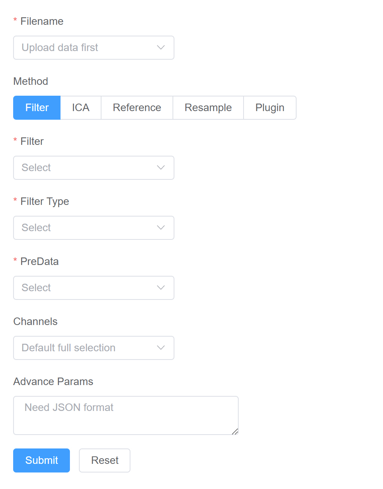
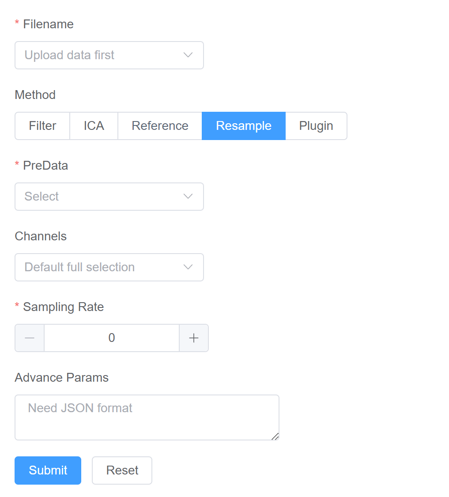
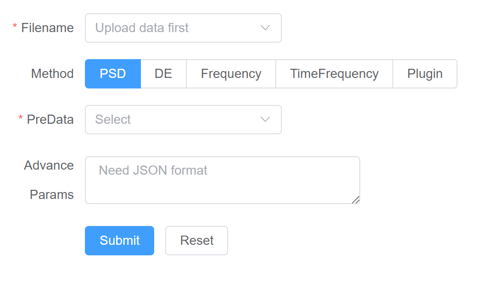
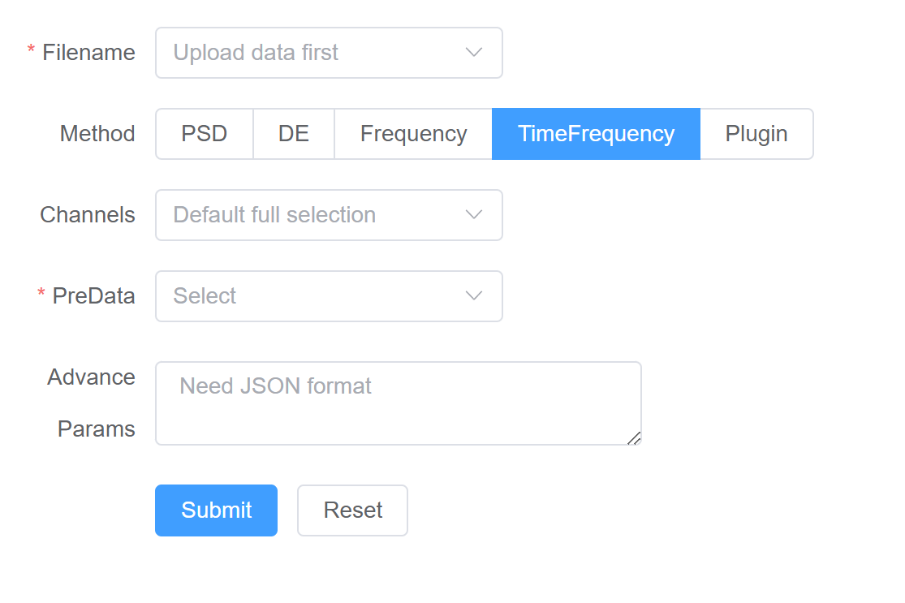
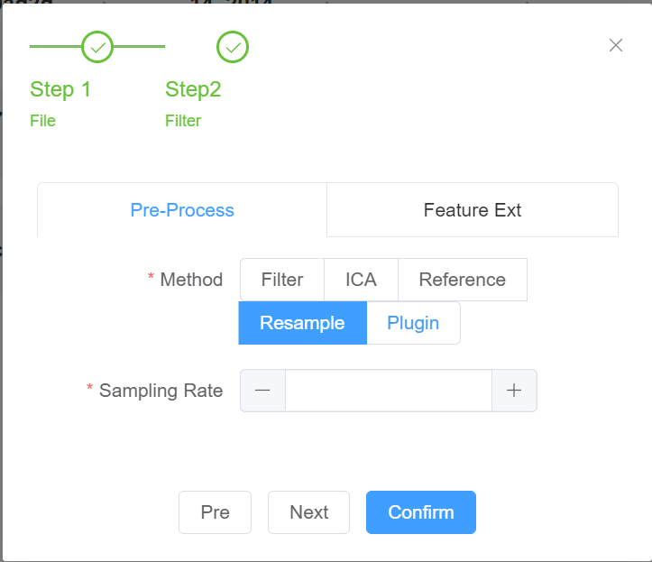

# MBBPE MANUAL

## Table of Contents

1. [Dashboard](#dashboard)
2. [Upload](#upload)
3. [Pre-Process](#preprocess)
    - [Filter](#filter)
    - [Independent Component Analysis](#independent-component-analysis)
    - [Reference](#reference)
    - [Resample](#resample)
4. [Feature Extraction](#feature-extraction)
    - [Differential Entropy](#differential-entropy)
    - [Frequency Analysis](#frequency-analysis)
    - [Power spectral density](#power-spectral-density)
    - [Time-Frequency Analysis](#time-frequency-analysis)
5. [Plugin](#plugin)
6. [Pipeline](#pipeline)
7. [Access Control](#access-control)
8. [Interactive Visualization](#interactive-visualization)

## Dashboard

The dashboard is primarily designed to showcase the uploaded files and their respective information. Here, you can
export and delete files as well.

> This dashboard supports the exporting of standard mat files or numpy array files.


- Filename: This refers to the name of the EEG data file.
- Sample Rate: This is the sampling rate of the EEG data.
- Data Type: This is used to record the type of data that has been processed.
- Action: This allows the user to export or delete data based on the selected Data Type.

> The Data Type is divided into two sections: PreProcess and Feature Extraction. By default, uploaded files will be
> labeled as raw.
>
> The `DE->Filter_Ref` label indicates that the file has undergone filter processing, followed by
> reference processing, and finally differential entropy feature extraction.

## Upload

This function allows you to upload files and select a specific processing method for the file. If a standard mat file is
being uploaded, you can specify the Format Mode for processing, such as Truncate or Pad.

> The Pad function is supported by numpy.pad, which includes the modes constant, edge, maximum, and more. For more
> details, visit [NumPy.pad](https://numpy.org/doc/stable/reference/generated/numpy.pad.html)

You can also process the data using a custom method via the uploaded plugin.


## Pre-Process

The pre-processing stage serves to eliminate noise and artifacts. It comes with built-in methods including Filter, ICA,
reference, and resample. Moreover, it also supports extensions using plugins.

You can submit processing tasks or reset uncommitted processing parameters.

> Users can pre-process specific files. However, please note that this panel operates synchronously, and thus you must
> wait for data processing to complete.

All pre-processing methods require the `PreData` parameter to be selected. This parameter is used for subsequent
processing based on the pre-data.

For example, if you select Filter for `PreData`, it means that subsequent processing will be based on Filter.


### Filter

The filter functionality uses the fir_filter method and requires several parameters:



- [required] Filename: The name of the file to be filtered
- [required] Filter: Filtering methods to be used
    - low-pass filtering
    - high-pass filtering
    - band-pass filtering
- [required] (Cutoff Frequency) or (Lowest Frequency and Highest Frequency): The Cutoff Frequency is required when the
  filter selects low-pass or high-pass filtering, while the Lowest Frequency and Highest Frequency are required when
  band-pass filtering is selected.
- [required] PreData: The pre-data for filtering
- [optional] Channels: The channels to be filtered, by default all channels are filtered

### Independent Component Analysis

The ICA method is based on sklearn's FastICA method.


- [required] Filename: The name of the file to undergo ICA
- [required] PreData: The pre-data for ICA

### Reference

The reference method requires the following parameters:


- [required] Filename: The name of the file to be referenced
- [required] PreData: The pre-data for referencing
- [required] Mode: reference Mode
    - average: Re-referencing based on the average of selected channels
    - channel: Selecting a specific channel as a datum for re-referencing
    - ear: Multiple channels can be selected as a reference for re-referencing
- [optional] Channels: Channels to be referenced, default is all channels
- [optional] Ref Channels: When Mode selects `channel` and `ear`, the `ref channels` is selected as the reference

### Resample

The Resample method requires the following parameters:



- [required] Filename: The name of the file to be resampled
- [required] PreData: The pre-data for resampling
- [required] Sampling Rating: The target sampling rate

## Feature Extraction

MBBPE facilitates the extraction of Differential Entropy, Frequency, Power Spectral Density (PSD), and Time-Frequency
features. It also supports the use of plug-ins for expansion.

### Differential Entropy

DE is implemented based on this [article](https://ieeexplore.ieee.org/document/6611075).The following parameters are
necessary for the process:


- [required] Filename: The name of the file to undergo DE.
- [required] PreData: The pre-data for DE.

### Frequency Analysis

We employ the wavelet packet transform for frequency conversion and require the following parameters for the
process:


- [required] Filename: The name of the file to undergo frequency analysis.
- [required] PreData: The pre-data for frequency analysis.
- [optional] Channels: Specific channels for frequency analysis. By default, all channels are included.
- [optional] BandList: This is a customized frequency decomposition range. It should be a JSON array of names and
  frequency ranges.

### Power spectral density

We utilize scipy's welch method to compute the PSD, which requires the following parameters:



- [required] Filename: The name of the file to undergo PSD.
- [required] PreData: The pre-data for PSD.

### Time-Frequency Analysis

We perform a time-frequency transformation of the EEG data using the wavelet transform. This process requires the
following parameters:



- [required] Filename: The name of the file to undergo time-frequency analysis.
- [required] PreData: The pre-data for time-frequency analysis.
- [optional] Channels: Specific channels for time-frequency analysis. By default, all channels are included.

## Plugin

MBPPE allows you to create custom plugins to cater to complex data processing scenarios.

Plugins should be defined in the form of functions with four available methods: `reader`, `process`, `extract`,
and `visualization`. These methods are responsible for data reading, data processing, data extraction, and data
visualization respectively. You can include one or more methods in a plugin, and MBPPE will automatically call the
appropriate methods based on different modules.

Here's a simple example of a plugin with all four methods:

```python
def reader(data, params, **kwargs):
    print("Executing reader method")
    # Modify data as needed
    return data


def process(data, params, **kwargs):
    print("Executing process method")
    # Modify data as needed
    return data


def extract(data, params, **kwargs):
    print("Executing extract method")
    # Modify data as needed
    return data


def visualization(data, params, **kwargs):
    import matplotlib.pyplot as plt
    import numpy as np

    x = np.linspace(0, 10, 100)

    y = np.sin(x)

    plt.figure()

    plt.plot(x, y)

    return plt
```

In this example, each method performs a specific action on the data and returns the modified data. The `visualization`
method also creates a plot of a simple function.

You can upload and manage plugins via the plugin module


Plugin allows users to utilize it like a built-in method, capable of both preprocessing and feature extraction. It
accepts the following parameters:

- [required] Filename: The name of the file to undergo plugin method.
- [required] plugin: Select a specific plugin method to be used.
- [required] PreData: The pre-data for plugin.
- [optional] Channels: By default, all channels are included.
- [optional] Params: This is for custom parameters that will be passed into the plugin method.


## Pipeline

The Pipeline module allows for the creation, monitoring, and management of multitasking pipelines.

### 1. Creating a Task

1. Begin by selecting the EEG signals and channel information that you would like to process.

   

2. Next, choose the processing method. The chosen methods will be executed sequentially in the order you selected.

   

### 2. Task Panel

The first column in the task panel is a unique identifier, generated by the UUID. The second column displays the name of
the file currently being processed. Subsequent columns detail the processing methods. Completed sessions are marked in
green. Black indicates that processing is ongoing, while gray indicates that the task is waiting to be processed.


### 3. Task Information

The task information section provides detailed processing information for each file. Here, you can download or delete
data, or delete the entire task. Information about the plot of the submitted task, including the channel and request
parameters, is also displayed. Users can leave comments in this section for documentation or communication purposes.


## Access Control

Permission control is established through the server configuration, and it is divided into three categories: manager(2),
reader only(1), and forbidden(0). The access control can be defined in `pyserver/common/constant.py`. There are two
methods to set it up:

1. Uniform setting:

```
{
    'active': True,
    'config': {
        'eaf1b968-449e-48c1-9233-888ad35f46e7': 2,
}
```

2. Route-Based Configuration

> Please note that routing configuration supports regular matching

```
{
    'active': False,
    'config': {
        'fa340bc5-8ef1-40f9-bf24-13491c6a8b95': {
            'default': 1, # The default value is used when no route is matched.
            'data/. */. *': 2, 
            'download': 1
        }}
}
```

After the secret key is configured, it is necessary for the user to add it.


## Interactive Visualization

Visualization is categorized into two types: Built-in Methods and Plug-in Methods.

Built-in Methods: These methods offer dynamic interaction and are further divided into two categories: Line maps and
Heat maps.

Line: These are used for displaying EEG, PSD plots, and frequency plots.（Local scaling and numeric display）

Heat Maps: These are utilized to showcase time-frequency plots.(numerical filtering)

Plug-in Methods: These are used to convert the visualization result into static images.

1. Linear
   
2. Heat Maps
   