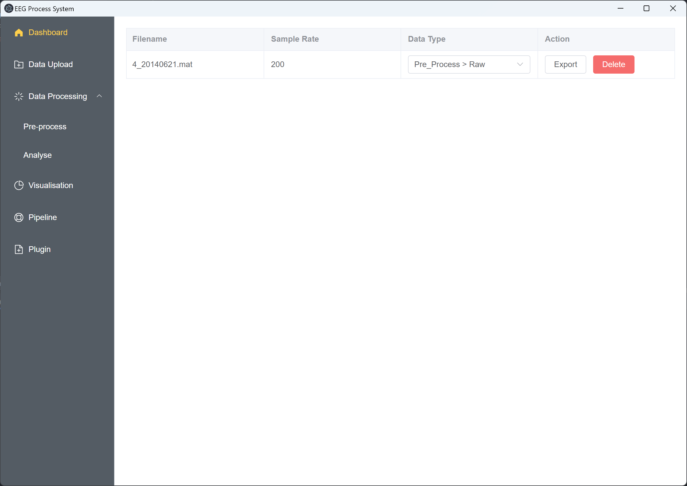

# MBPPE

A new modular EEG processing platform designed to facilitate pre-processing, feature extraction, and visualization of
EEG signals. This system automates batch processing through the creation of customized workflows and offers the
flexibility of personal offline usage or private deployment.

## Quick Start

1. Init env

During development, I used Node.js > 16.5 and Python 3.11.4 as the base environment. You can download Nodejs from the
following [link](https://nodejs.org/en).

> You may need to restart your computer after installing NodeJS to update the Node environment.

2. Install dependencies

```
# Download Project
git clone https://github.com/wavescycle/MBPPE.git

cd MBPPE

# Install Python Env
pip install -r requirements.txt

# Install Node Env
npm i
```

3. Start APP

You can choose one of the following two methods to run the code.

```
# 1. Dev with Client [Offline Mode]
npm run dev:local

# 2. Dev with Broswer [Online Mode]
npm run dev:broswer
```

> The first time you run `npm run dev:local`, a blank page may appear. This is because the program startup speed is
> faster than the page generate time. You can resolve this issue by running the command again.
>
> If you are using the `npm run dev:broswer` command, you need to access http://localhost:3000/ using your browser
> according to the output log.

## Preview



To access the complete user manual, please refer to the [MANUAL](./MANUAL.md).

1. Dashboard: Used to display the data information that has been processed in the current system.
2. Data Upload: Users can upload EEG data files in batches.
3. Pre Process: Preprocess EEG signals in a synchronous manner.
4. Analyse: Extract features from EEG signals in a synchronous manner.
5. Visualisation: Used for data visualization.
6. Pipeline: Used for creating and monitoring batch task sequences for multiple tasks
7. Plugin: Plugin methods, used for users to upload custom methods to meet more complex scenarios.

## Project Structure

The following is the primary structure of MBPPE, which may assist in enhancing your understanding of the code.

```
│  index.html # Main structure of HTML
│  main.js # Electron's main process file for system tasks
│  package.json # NodeJS dependencies
│  requirements.txt # python dependencies
│        
│      
├─pyserver # Server Code
│  │  app.py  # Main file of the server (Flask application) [router adapter]
│  │  __init__.py
│  │  
│  ├─common # Common methods
│  │    constant.py # Constants and structures storage
│  │    customSchema.py  # Custom schema for managing request parameters
│  │    decorator.py #  Decorator functions (init_data, init_channel)
│  │     __init__.py 
│  │          
│  ├─plugins # Plugin storage
│  │    demo.py # Plugin example
│  │    
│  │          
│  └─router # Server routes
│    ├─common
│    │    comment.py # Comment-related routes
│    │    data.py # Data-related routes for data upload and download
│    │    file.py # Routes for retrieving uploaded files list
│    │    __init__.py
│    │      
│    ├─fearure # Feature extraction routes
│    │  │  de.py # Differential entropy request handling routes
│    │  │  frequency.py # Frequency analysis request handling routes
│    │  │  psd.py #  Power spectral density request handling routes
│    │  │  timefrequency.py # Time-frequency analysis request handling routes
│    │  │  __init__.py
│    │  │  
│    │  └─methods
│    │      buildIn.py # Differential entropy, frequency, psd, time-frequency methods implementation
│    │      __init__.py
│    │      
│    │                    
│    ├─pipeline # Pipeline routes
│    │  │  pipeline.py # Pipeline request handling routes
│    │  │  __init__.py
│    │  │  
│    │  └─methods
│    │      buildIn.py # Asynchronous methods for pipeline
│    │      utils.py # Tool for parsing uploaded task information in pipeline
│    │      __init__.py
│    │      
│    │          
│    ├─plugin # Plugin routes
│    │    manager.py # Plugin methods for registering, getting, and deleting plugins
│    │    plugin.py # Plugin request handling routes
│    │    __init__.py
│    │    
│    │          
│    └─preprocess # Preprocessing routes
│        │  filter.py # Filter request handling routes
│        │  ica.py # Independent Component Analysis request handling routes
│        │  reference.py # Reference request handling routes
│        │  resample.py # Resample request handling routes
│        │  __init__.py
│        │  
│        └─methods
│            buildIn.py # Filter, ICA, reference, resample methods implementation
│            __init__.py
│            
│                       
└─src #  Client-side code
    │  
    ├─components
    │      Sidebar.vue # Side navigation bar component
    │      
    ├─config
    │      config.json # Custom server address configuration file
    │      
    │      
    ├─utils # Client utilities
    │      api.js # Functions for backend interface calls [interface Driver]
    │      charts.js # Functions for chart generation
    │      npy.js # Script to convert numpy data to JavaScript array
    │      request.js  # Functions for network requests
    │      
    └─views # UI of Client
            BaseCharts.vue # Visualization UI
            Dashboard.vue # Dashboard UI
            Feature.vue # Feature extraction UI
            Home.vue
            Pipeline.vue # Pipeline UI
            Plugin.vue # Plugin UI
            PreProcess.vue  # Pre-processing UI
            Upload.vue # Upload EEG data UI                 
```